# Continuous Deployment with OCI DevOps Pipeline

## Introduction

So far, as SRE/Platform Engineer, we were responsible to provision all the infrastructure resources used by this project. In this lab exercise, we are going to deploy a Java Cloud Native application (Mushop fulfillment microservice ) into the Kubernetes Cluster on Oracle Container Engine for Kubernetes (OKE) through a Continuous Deployment pipeline using OCI DevOps.


Up to this point, the Container Image built by our development team is already available in the Oracle Cloud Infrastructure Registry. As SREs, we are responsible for designing and updating the Continuous Deployment workflow in the OCI DevOps service to release the application to our customers. 


Before jumping into the lab steps, let's understand key concepts of OCI DevOps:

---
| Projects

A project is a logical grouping of DevOps resources needed to implement your CI/CD workload. DevOps resources can be Artifacts, Deployment Pipelines, and Environments.
Projects makes it easy to enable logging, monitoring, and notifications for all your DevOps resources. The best practice is to group each application and all its microservices into a single project.


| Artifacts

A collection of text files, binaries, and deployment manifests that will be delivered to the target deployment environment. DevOps artifacts can point to an OCI Registry container image repository path, a generic artifact repository path, or provided inline. Artifacts must be in an OCI repository to work with the OCI DevOps service. We have this restriction so that OCI DevOps can ensure that the software version deployed contains the artifact versions specified - and then can rollback to a specific version that has not changed.

A DevOps Artifact is a reference or pointer to any file, binary, package, manifest, or Image that makes up your application. When creating an Artifact, you have to inform Oracle DevOps of the source location of the actual Artifact. DevOps supports OCI object storage, OCIR, or any generic Artifact Repository.
DevOps lets you "upload" an Artifact directly, this stores the Artifact in an OCI internal artifact location and creates a DevOps Artifact, which is just a Reference to it. 

Deleting an OCI DevOps Artifact only deletes the reference and does not delete the Artifact itself.


| Environment

An Environment is a collection of a customer’s computing resources where Artifacts will be deployed to. Environments can be a Function, Compute VM or BM instances, or an OKE cluster. Environments can be in different OCI regions than the region of the Deployment Pipeline - so developers can run a Deployment to multiple OCI regions.


| Deployment Pipeline

A Deployment Pipeline holds the requirements that must be satisfied to deliver a set of Artifacts to an Environment. Pipelines contain stages which are the building blocks of a Pipeline. A Pipeline can have Stages that run serially or in parallel, so you can control the flow and logic of your software release.


| Stage

Stages are an individual action that takes place during a run of a Pipeline. The DevOps Deployment pipeline includes pre-defined stage types for you to use in your release process:
- Rolling deployment - an incremental release to OKE, Functions, or Instance Groups
- Wait: wait N seconds
- Manual Approval: proceed if an approval is given, stop if an approval is rejected
- Traffic Shift: control the traffic sent to backend sets of a load balancer
- Invoke Function - preform custom tasks and integration by calling an OCI Function, and pass an artifact of request parameters
- Run OKE Job - run an OKE Job (different than a Deployment)
- Run Deployment - trigger the start of another Deployment Pipeline


| Deployment

The execution of the Deployment pipeline, and its release to the target environment.


| Rollback

Release a previous version, or updated version of your software, to fix an issue identified with a Deployment


| Pipeline Parameters 

Pipeline Parameters are names of placeholders that exist in DevOps resources. They are available to all resources within the deployment pipeline. They are names with an optional default value. When the pipeline is run, arguments must be provided for all the pipeline parameters that do not have a default value.

---

Estimated time: 30 minutes

### Objectives

In this lab, you will:

* Create DevOps Artifacts
* Define Pipeline Parameters
* Create DevOps Pipeline
* Deploy New Software Version on Kubernetes OKE cluster

### Prerequisites

* An Oracle Free Tier(Trial), Paid or LiveLabs Cloud Account
* GitHub account


## Task 1: Create Artifacts

 First step we need to create the Artifacts that will contains the Kubernetes manifest files that are used to deploy the Application.

1. Let's open the OCI DevOps project. Go to OCI Navigation Menu -> Developer Services -> DevOps -> Projects. The project name should starts with `hello`. Click on the project name to go to the Project Overview page. Some resources were automatically provisioned through Terraform and we are going to reuse some of them.

    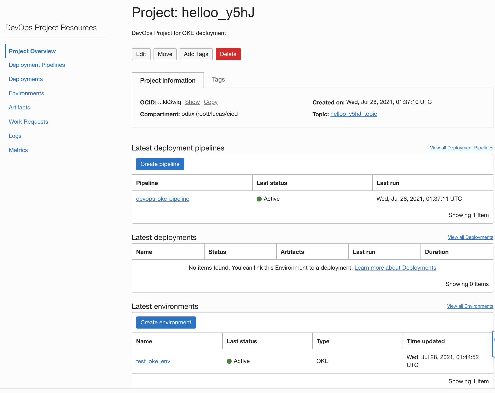 

1. Create your Artifact. In the bottom of the page, click `Add artifact` under Latest artifacts section and the Add Artifacts page will be presented.
    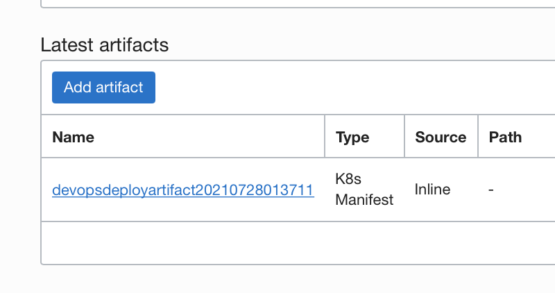 
    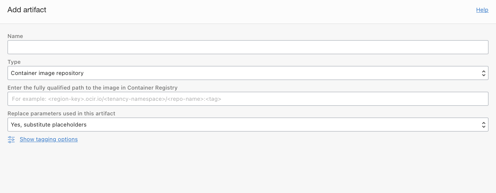 

1. In the Name field, enter `fulfillment-deployment.yaml`.


1. In the Type selector, select `Kubernetes Manifest`.
     

1. The `Artifact source` selector will show up in the form, then select `Inline`.
     

1. The `Value` text field should also show up. Paste the content from the K8s Deployment manifest file below. You can leave the `Replace parameters used in this artifact` selector with the default value `Yes, substitute placeholders`.
    
    ```yaml
    apiVersion: apps/v1
    kind: Deployment
    metadata:
      name: fulfillment
      labels:
        app.kubernetes.io/name: fulfillment
        app.kubernetes.io/instance: mushop
        run: fulfillment
    spec:
      replicas: 1
      minReadySeconds: 30
      selector:
        matchLabels:
          app: fulfillment
          app.kubernetes.io/name: fulfillment
          app.kubernetes.io/instance: mushop
          run: fulfillment
      template:
        metadata:
          labels:
            app: fulfillment
            version: "1.1.0"
            app.kubernetes.io/name: fulfillment
            app.kubernetes.io/instance: mushop
            run: fulfillment
          annotations:
            sidecar.istio.io/rewriteAppHTTPProbers: "true"
            prometheus.io/scrape: "true"
            prometheus.io/path: /prometheus
            prometheus.io/port: "80"
        spec:
          containers:
            - name: fulfillment
              image: "iad.ocir.io/idi2cuxxbkto/oci-cloud-native-mushop/mushop-fulfillment:${mushop_fulfillment_version}"
              imagePullPolicy: IfNotPresent
              ports:
                - name: http
                  containerPort: 80
                  protocol: TCP
              env:
                - name: NATS_HOST
                  value: "nats"
                - name: NATS_PORT
                  value: "4222"
                - name: ORDERS_NEW
                  value: "orders"
                - name: ORDERS_SHIPPED
                  value: "shipments"
                - name: SIMULATION_DELAY
                  value: "10000"    
    ```

    Before saving it, if you look at the code carefully, you will notice that we are not using a hardcoded container image tag. We specified a [parameter](https://docs.oracle.com/en-us/iaas/devops/using/configuring_parameters.htm) `${mushop_fulfillment_version}` that represents the container image tag and can be defined by the DevOps pipeline itself.
    
    Here is how the Artifact form should look like. Click on `Add` to save it.
    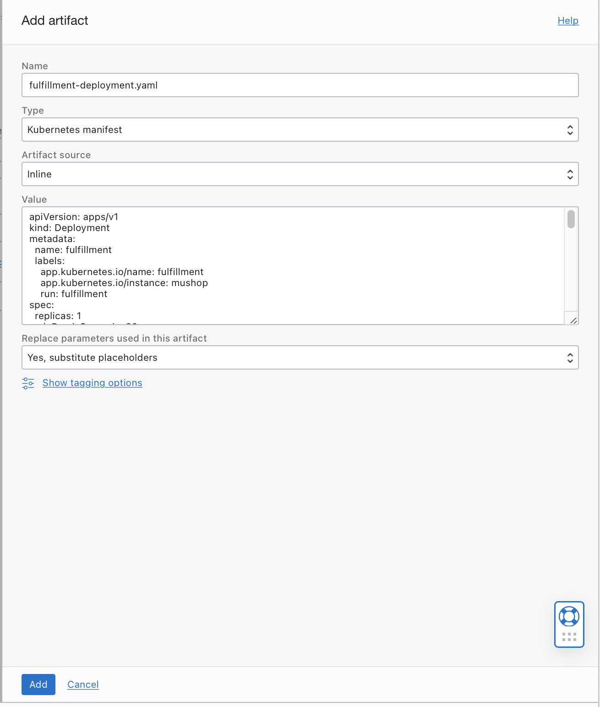 

1. Repeat this process for the following Artifacts:

    > fulfillment-service.yaml  
    ```yaml
    apiVersion: v1
    kind: Service
    metadata:
      name: fulfillment
      labels: 
        app.kubernetes.io/name: fulfillment
        run: fulfillment
    spec:
      selector:
        app.kubernetes.io/name: fulfillment
        run: fulfillment
      ports:
        - port: 80
          name: http
          protocol: TCP
          targetPort: 8082
    ```
    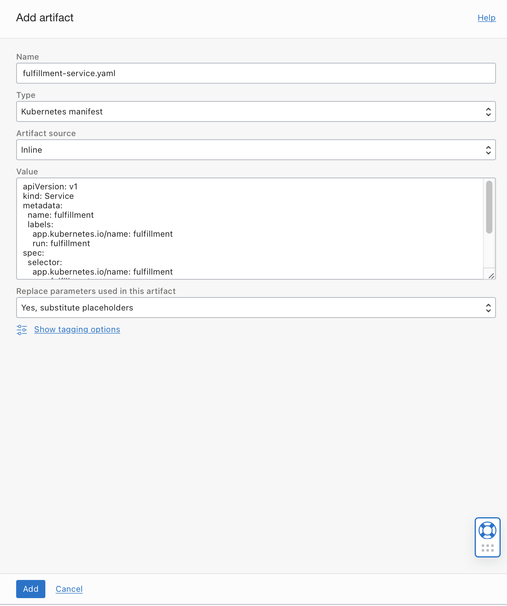 


    > nats-deployment.yaml  
    ```yaml
    apiVersion: apps/v1
    kind: Deployment
    metadata:
      name: nats
      labels:
        app.kubernetes.io/name: nats
        run: nats
    spec:
      replicas: 1
      minReadySeconds: 30
      selector:
        matchLabels:
          app: nats
          app.kubernetes.io/name: nats
          run: nats
      template:
        metadata:
          labels:
            app: nats
            version: "2.1.2"
            app.kubernetes.io/name: nats
            run: nats
          annotations:
            sidecar.istio.io/rewriteAppHTTPProbers: "true"
            prometheus.io/scrape: "true"
            prometheus.io/path: /metrics
            prometheus.io/port: "7777"
        spec:
          containers:
            - name: nats
              image: "nats:2.1.2"
              imagePullPolicy: IfNotPresent
              ports:
                - name: client
                  containerPort: 4222
                  protocol: TCP
                - name: routes
                  containerPort: 6222
                  protocol: TCP
                - name: monitoring
                  containerPort: 8222
                  protocol: TCP
    ```
    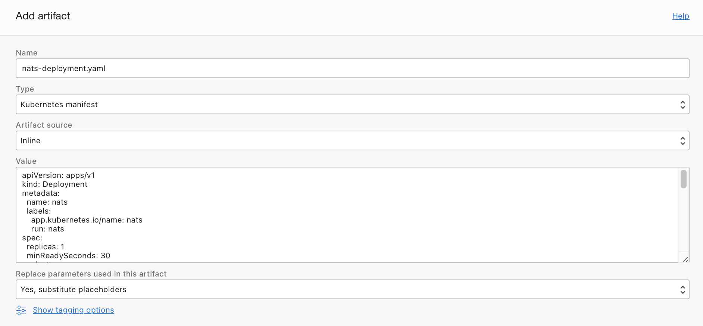 


    > nats-service.yaml
    ```yaml
    apiVersion: v1
    kind: Service
    metadata:
      name: nats
      annotations:
        prometheus.io/path: "/prometheus"
      labels:
        app.kubernetes.io/name: nats
        app.kubernetes.io/instance: mushop
        run: nats
    spec:
      selector:
        app.kubernetes.io/name: nats
        run: nats
      ports:
        - name: client
          port: 4222
          protocol: TCP
          targetPort: 4222
        - name: routes
          port: 6222
          protocol: TCP
          targetPort: 6222
        - name: monitoring
          port: 8222
          protocol: TCP
          targetPort: 8222  
    ```
    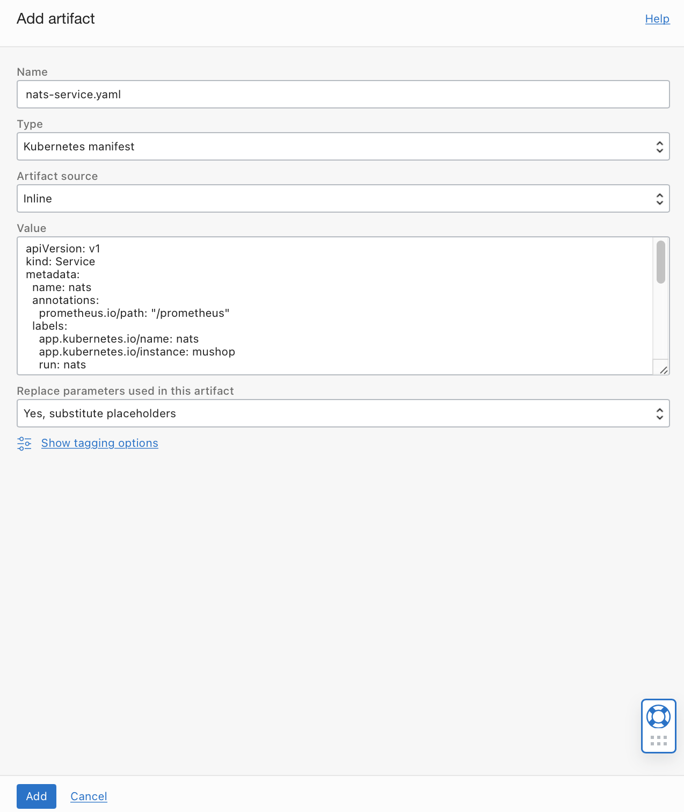 

At the end, you will have the following artifacts:
    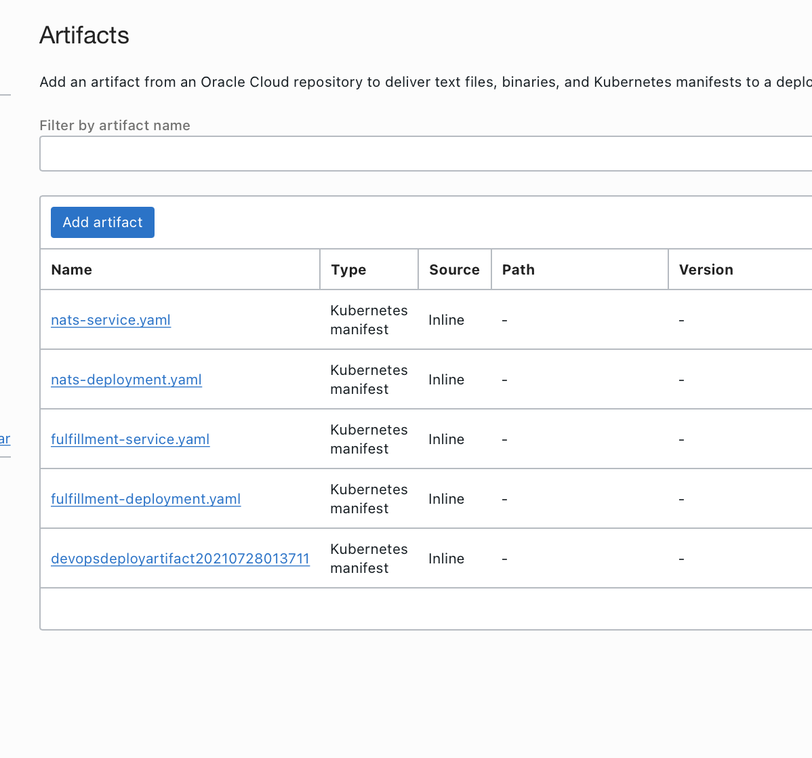 

In the next steps, we are going to design a Pipeline and define a Parameter for the Container Image Version which will be applied to the manifest during the CD workflow.


## Task 2: Create DevOps Deployment Pipeline

Let's create a DevOps Deployment Pipeline for publishing the Mushop fulfillment service and NATS. 

This is going to publish multiple artifacts to our OKE environment. 

1. Go to Deployment Pipelines (left hand side menu of your DevOps project) and click on Create Pipeline.
    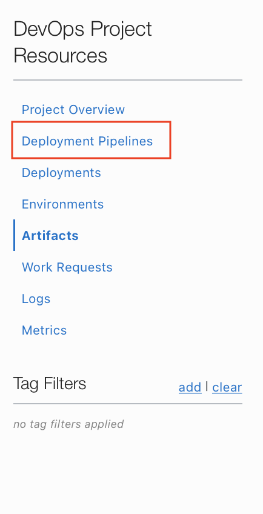 

1. Enter a name and a description for the pipeline and then click on Create pipeline:
    |Property Name|Property Value|
    |--|--|
    |Name|deploy-fulfillment-to-dev|
    |Description|Deploy Mushop Fulfillment service to OKE Development environment|

    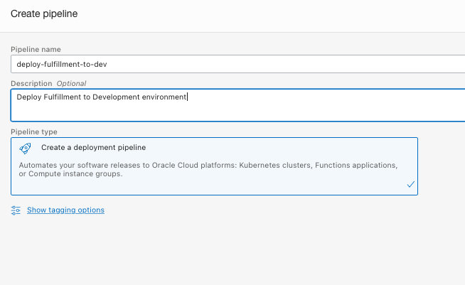

1. Before start designing the pipeline stages, we need to create the parameter we used in the Artifact. Click on Parameters tab and enter the following data:

    |Name|Default Value|
    |--|--|
    |`mushop_fulfillment_version`|Enter the default tag name that is used to publish mushop-fulfillment image: `1.2.0-SNAPSHOT`|
    |Description|Default version of mushop-fulfillment image.|

1. Click on the plus button to save the parameter into the table.
     

    Here is the resulting table:

     


1. Click on the `Pipeline tab` on the top of the page so that you can start designing your CD pipeline.
    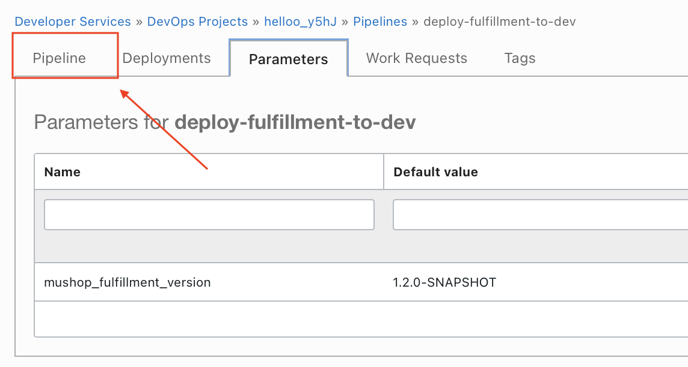 

1. Before designing the pipeline, we need to look at the topology diagram to understand our application and all dependencies. The fulfillment application POD is deployed through the Deployment manifest and exposed via the Fulfillment Service. The Fulfillment Service needs to communicate with the NATS service which is the endpoint for the NATS application PODS responsible for exchanging Messages with the Order system. When designing the Pipeline, we need to ensure that NATS is deployed before Fulfillment so that it can integrate with other services via the Messaging application.

    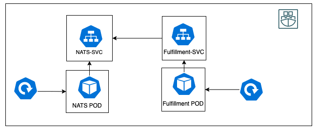 

1. Let's add the first `Stage` to your Pipeline. Each stage represents an action in the deployment pipeline, e.g. applying a Kubernetes manifest to our cluster. You can add multiple stages to a pipeline, which can be added vertically in a sequence or in parallel. Click on the plus icon to add a Stage.
     

1. Click on `Add Stage` popup button:
     

1. OCI DevOps also allow you to add integrations and control stages to any deployment. For example, you can request an approval before proceeding to the next stage of the pipeline or use an automatic approval. We are going to use the automatic approval. Under `Deploy`, select `OKE:Default (Apply manifest to your Kubernetes cluster)`, then click on next.

     

1. You can start your design by picking up any Stage. Then, when creating additional Stages, you can select whether to place it before or after an existing Stage. In this task, we are going to create a Pipeline with 3 Stages:
    - NATS: both service and deployment Artifacts deployed in a single Stage. 
    - Fulfillment Service
    - Fulfillment Deployment

    They should deploy the Artifacts in the following order:

    (1) Nats Deployment -> (2) Nats Service -> (3) Fulfillment Deployment -> (4) Fulfillment Service

    However, to illustrate the flexibility you have to design your pipeline, we are going to start creating the Stage responsible for deploying the Fulfillment Deployment Artifact (3).

1. In the next window, enter the name and description of the stage, select the target environment, Artifact(s) and whether you want to Override the Kubernetes namespace and also rollback to the last successful version of the Artifact in case of failure, as specified in the table below:

    |Property Name|Property Value|
    |--|--|
    |Stage Name|fulfillment-deployment|
    |Description|Apply Deployment manifest for fulfillment |
    |Environment|`test_oke_env`|
    |Select one or more artifacts|fulfillment-deployment.yaml|
    |Override Kubernetes namespace|Leave empty|
    |If validation fails, automatically rollback to the last successful version?|Yes|

    

    *Note*: The target environment will only be available after the Stack job in `Lab 1` completed provisioning the OKE environment. If you got up to this point while the Stack was still running the job, you may have to wait a bit. You can check the logs and status of the Stack job in ORM.

1. Here is how the Deployment pipeline shows up after defining the first Stage:
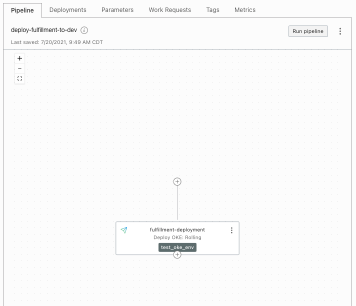 
  
1. Next, let's create a single stage for deploying the NATS Artifact, which should deploy before the Fulfillment Deployment stage. That means, we should create the stage on top of the fulfillment deployment. Click on the plus sign on top of fulfillment-deployment stage, then Add Stage.
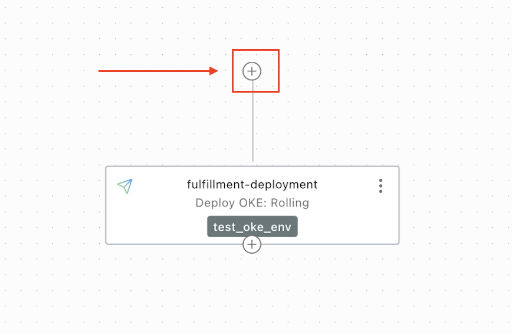 

1. Select `OKE:Default (Apply manifest to your Kubernetes cluster)` and click Next.

1. In the next window, enter the following data then click on `Add`:

    |Property Name|Property Value|
    |--|--|
    |Stage Name|nats|
    |Description|Apply Deployment and Service manifest for nats |
    |Environment|`test_oke_env`|
    |Select one or more artifacts|nats-deployment.yaml, nats-service.yaml|
    |Override Kubernetes namespace|Leave empty|
    |If validation fails, automatically rollback to the last successful version?|Yes|

    

    Note that we are grouping the Artifacts into the same Stage. This makes the DevOps service to submit a request to the Kubernetes Server-Side Apply API in the order we created the Artifacts in the table. 
    In case of failure, the DevOps service will roll back *all* Artifacts defined in this Stage, ensuring you have an atomic transaction - all artifacts deploy successfully or fail.
    

    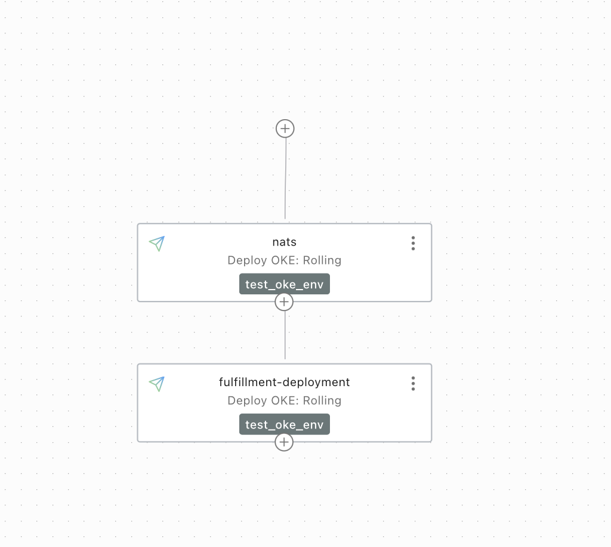

1. Finally, we are going to create a stage for the fulfillment service. Click on the plus sign underneath fulfillment-deployment, then Add Stage.
    

1. Next, Select `OKE:Default (Apply manifest to your Kubernetes cluster)` and click Next.

1. In the next window, enter the following data then click on `Add`:

    |Property Name|Property Value|
    |--|--|
    |Stage Name|fulfillment-service|
    |Description|Apply Service manifest for fulfillment |
    |Environment|`test_oke_env`|
    |Select one or more artifacts|fulfillment-service.yaml|
    |Override Kubernetes namespace|Leave empty|
    |If validation fails, automatically rollback to the last successful version?|Yes|

    

As the result, we have the following DevOps Pipeline:


## Task 3: Deploy Fulfillment Service to OKE

You can run a pipeline directly from the OCI Console or you can build integrations with the API, CLI or some external integrations. 

1. Click `Run Pipeline` on top right corner. 
  

1. The Start Manual Run page is displayed. 

1. Enter a name for your deployment or use the suggested name. 

1. In the Parameters section, you can change the default value setup for the given parameter. In this case, the Container Image tag should be `1.2.0-SNAPSHOT` as you can see in the picture below. In the future, when the development team will release a new image, you can run a new pipeline and update the parameter only.

  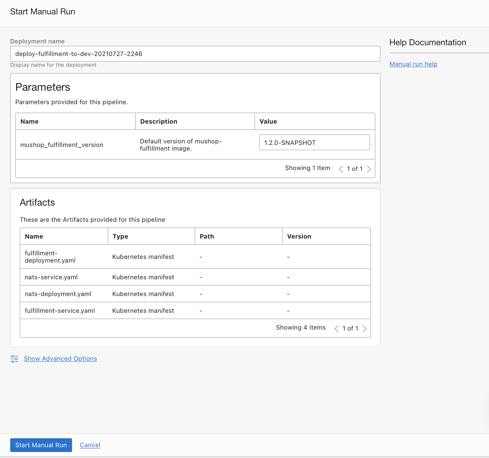

Finally, click on Start Manual Run to trigger the pipeline.


1. You can follow the progression of the pipeline directly from the Deployment page. Every stage that is running change its color to yellow. After completes the stage, it turns into green in case of success or red in case of failure. You can also visualize some logs from Kubernetes OKE cluster on the right hand side of the page:
  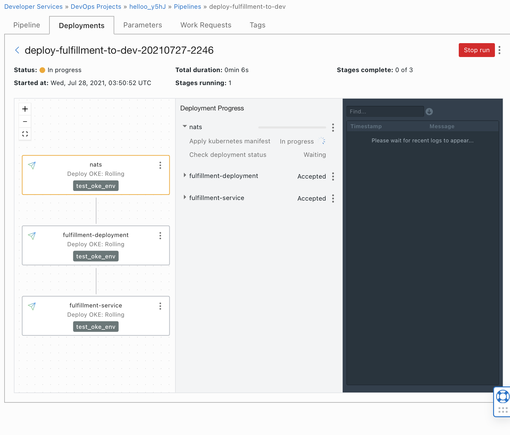

1. After completing the pipeline, all stages should be green and the status of the Deployment `Succeeded`.
  
  
1. (Optional) You can also use [OCI Cloud Shell](https://docs.oracle.com/en-us/iaas/Content/API/Concepts/cloudshellintro.htm) to monitor the status of the Kubernetes resources you are deploying using `kubectl`, the [Kubernetes cli](https://kubernetes.io/docs/reference/kubectl/overview/). You first need to [set up a connection with your cluster](https://docs.oracle.com/en-us/iaas/Content/ContEng/Tasks/contengdownloadkubeconfigfile.htm#cloudshelldownload), and then use `kubectl` to monitor the deployment of the resources:

    ```
    kubectl get svc -w
    ```
    or
    ```
    kubectl get deploy -w
    ```

1. You can check the history of all your Deployment Pipelines in the left hand side menu, by clicking on `Deployments`:

    


## Task 4: (Optional) Test Fulfillment Service

The application was deployed for the first time, all stages in the Deployment pipeline are green, now you want to test the application without having to deploy any additional component (e.g. Ingress). The easiest way to do this is connecting to the OKE cluster via Cloud Shell and use a NATS client running in a K8s pod to generate some messages to the NATS service which can then be consumed by the Fulfillment service API.

1. Open up Cloud Shell, and let's create a nats client pod using the following command:
    ```
    kubectl run -i --rm --tty nats-box --image=synadia/nats-box --restart=Never
    ```

1. Press enter to gain access into the container shell. Push some data into the message queue with the following commands and json payloads:
    ```
    nats pub -s nats://nats:4222 mushop-orders '{"orderId":1}'
    nats pub -s nats://nats:4222 mushop-orders '{"orderId":2}'
    nats pub -s nats://nats:4222 mushop-orders '{"orderId":3}'
    ```
    After sending each message, you should get the following outcome in the shell:
    ```
    Published 13 bytes to "mushop-orders"
    ```
    Type `exit` to destroy the pod.

1. Let's use another pod with `curl` available to query our Fulfillment service. Run the command to create a pod: 
    ```bash
    kubectl run -i --rm --tty curl --image=radial/busyboxplus:curl --restart=Never
    ```

1. Once inside the pod, query the fulfillment service endpoint:
    ```
    curl http://fulfillment:80/fulfillment/1
    ````

1. If you get the response like in the example below that means your service is up and running and is able to process requests.

    Response:
    ```
    Order 1 is fulfilled
    ```    
    Type `exit` to destroy the pod.

You may now proceed to the next lab.

## Acknowledgements

* **Author** - Lucas Gomes
* **Contributors** -  Jonathan Schreiber, Rishi Johari, Tim Graves
* **Last Updated By/Date** - Lucas Gomes, July 2021
