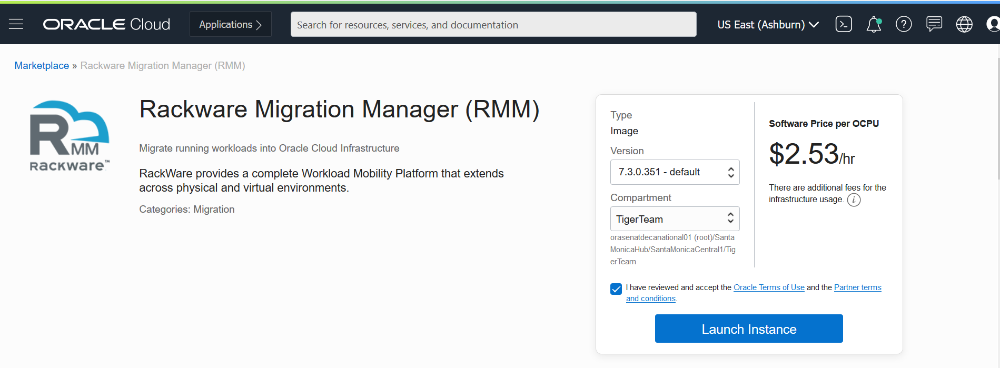
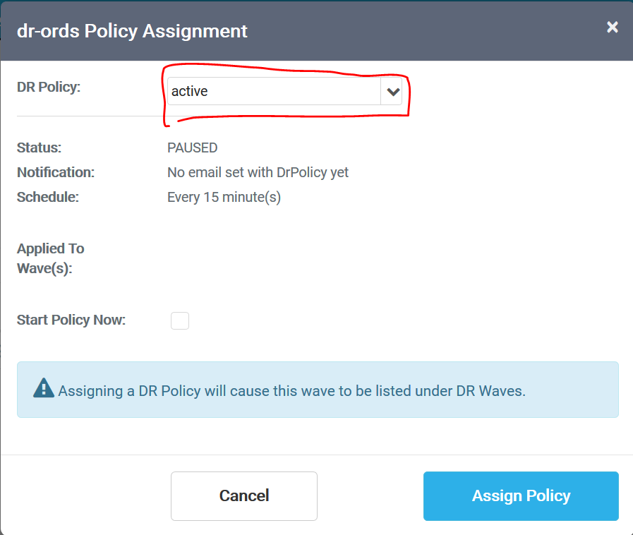

# Setting Up RackWare DR Components
## Introduction
This lab walks through the steps for configuring the RackWare Migration Manager (RMM), which replicates the source APEX instance.

Estimated Lab Time: 45-60 minutes

### Objectives
- Import the RMM
- Configure the RMM to replicate to the source instance
- Setup the DR policy

### Prerequisites
- Successful completion of previous labs in this workshop

## Task 1: Import RMM Image from Rackware
1.	Navigate to <a href="https://cloudmarketplace.oracle.com/marketplace/en_US/homePage.jspx" target="_blank">Oracle Marketplace</a>
2.	Search "RackWare" and select the "RackWare Migration Manager (RMM)"
    
3.	Click "Get App" and sign into your OCI Console
    
4.	Launch the instance in the target compartment (This should be the same compartment as the one that will contain the instances of the migrated servers.)
    
5.	Enter a Name for the instance.\
    a.	e.g. dr_rackware_rmm
6.	Give the instance a shape appropriate for your deployment.
7.   In the ‘Add SSH Keys’ either upload your ssh key to connect to the instance after it is created or paste the key contents
    

## Task 2: Configure the RackWare Migration Components
Use the following **[guide](https://www.rackwareinc.com/rackware-rmm-oracle-marketplace-dr-march-2020)** to complete the RackWare deployment configuration. (Use the passthrough method)

## Task 3: Create DR policy in RackWare
**After you have completed the RackWare guide you must make a DR policy in RackWare to keep the source & target machines synced.**
1. Start by navigating to the RackWare GUI and loging in with your RackWare admin credentials.
      

2. Under **DR** on the left-hand side select **Policies** and click the **+** button.
    

3. Enter a name and a frequency for syncing your machines. The rest of the fields are optional. Click **Create**.
    

4. From the RackWare GUI, locate the wave you replicated and click the blue name.
    

5. Click the blue ***No Policy*** button right of the DR label
    

6. Select the DR Policy you just created from the dropdown and click Assign Policy.
        

7. Use the left & right arrows to preform Failover & Fallback.
      
    
You may now **proceed to the next lab.**

## Acknowledgements
- **Author** - Will Bullock
- **Last Updated by/date** Will Bullock, October 2020

