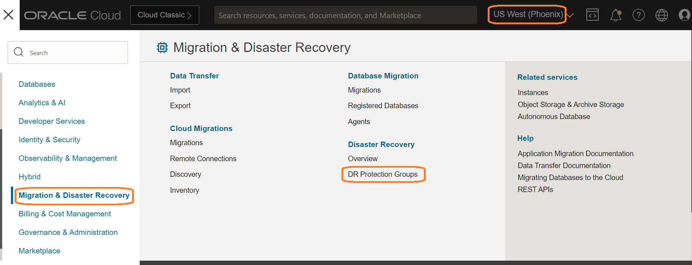
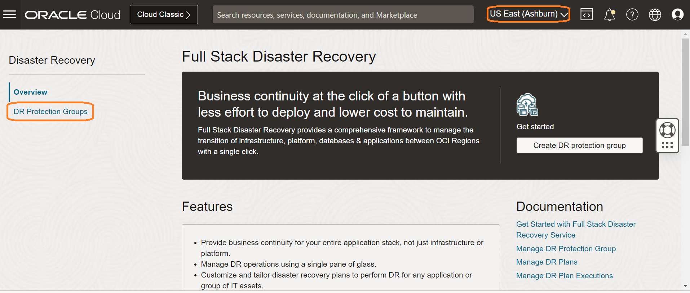
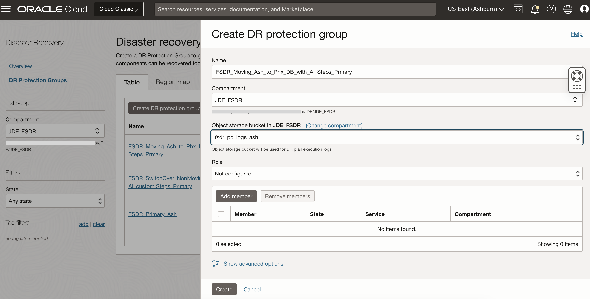
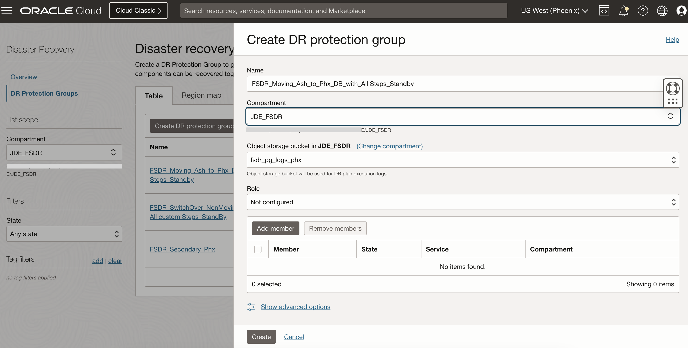

# Create and Associate Disaster Recovery Protection Groups

## Introduction

In this lab, we will Create and Associate Disaster Recovery Protection Groups (DRPG). Ashburn is the primary region and Phoenix is the standby region.

What is DRPG – A resource type used by Full Stack Disaster Recovery.  A DR Protection Group represents a consistency grouping defined for the purposes of disaster recovery.  It is a collection of different OCI resources that comprise an application and must be treated as a combined group when performing disaster recovery operations.  For example, a DR Protection Group may consist of application servers (compute instances), associated block storage (grouped as volume groups) and databases.

Estimated Time: 15 Minutes

### Objectives

- Create DRPG in Ashburn and Phoenix regions.
- Associate Ashburn DRPG as primary and Phoenix DRPG as Standby

## Task 1: Create DRPG in Ashburn and Phoenix regions

1. Login into OCI Console. The primary region should be **Ashburn**.

    

   Open another browser tab and then select the region as **Phoenix** (Standby Region)

    

2. In the first browser tab,Select **Migration and Disaster Recovery** from the Hamburger menu, then **Disaster Recovery** -> **DR Protection Groups**. Verify the region is **Ashburn**

    

3. In the second browser tab,Select **Migration and Disaster Recovery** from the Hamburger menu, then **Disaster Recovery** -> **DR Protection Groups** Verify the region is **Phoenix**

    

4. You will land up at the Full Stack Disaster Recovery home page; click on DR Protection Groups and make sure to have two tabs opened for Ashburn and Phoenix region.

    
    

5. Create DRPG in the Ashburn region. Click on Create DR Protection group in the Ashburn region browser tab.

    - Provide a name for the Full Stack Disaster Recovery Protection Group
    - Select the right compartment
    - Select the object storage bucket created in Lab 1 which is **fsdr\_pg\_logs\_ash**
    - Ignore Role and leave as **Not Configured**
    - Ignore Add member 

    

    Click on Create.

6. Create DRPG in the Phoenix region. Select Create DR Protection group in the Phoenix region browser tab.

    - Provide a name for the Full Stack Disaster Recovery Protection Group
    - Select the right compartment
    - Select the object storage bucket created in Lab 1 which is **fsdr\_pg\_logs\_phx**
    - Ignore Role and leave as **Not Configured**
    - Ignore Add member

    

    Click on Create.

## Task 2: Associate Ashburn DRPG as primary and Phoenix DRPG as Standby

1. From the Ashburn region OCI console, select **FSDR\_Moving\_Ash\_to\_Phx\_DB\_with\_All Steps\_Prmary** DRPG. Select the **Associate** button

   

   - Select Role as **Primary**
   - Select Peer Region as **US West (Phoenix)**,
   - Select Peer DR Protection group in the compartment (change assigned compartment if required); you should select **FSDR\_Moving\_Ash\_to\_Phx\_DB\_with\_All Steps\_Standby**
   - Verify and associate

  

  Navigate back to the DR Protection group home page. You should be able to see DRPG **FSDR\_Moving\_Ash\_to\_Phx\_DB\_with\_All Steps\_Prmary** state as *Active*, role as *Primary*, peer region as *US West (Phoenix)*

  

   Now, we have associated **FSDR\_Moving\_Ash\_to\_Phx\_DB\_with\_All Steps\_Prmary** as *Primary DRPG* and **FSDR\_Moving\_Ash\_to\_Phx\_DB\_with\_All Steps\_Standby**  as *Standby DRPG*

   You may now **proceed to the next lab**.

## Acknowledgements

* **Author:** Tarani Meher, Senior JDE Specialist
* **Last Updated By/Date:** Tarani Meher, Senior JDE Specialist, 01/2024
