# Pre-requisites for Full Stack Disaster Recovery

## Introduction

In this lab, we will complete the pre-requisites setup work for Full Stack Disaster Recovery. Note that this is applicable for both Moving and Non-Moving scenarios.

Estimated Time: 60 Minutes

### **Objectives**

- Enable Run Commands on all the Compute Instances.
- Prepare Object Storage Buckets for Operation Logs.
- Prepare Oracle Databases for Full Stack Disaster Recovery.
- Create Volume Group with all boot and block volumes for JDE VMs.
- Create Automation Scripts and Backup Files for the DR Switchover. 

### **Prerequisites and General Information**

An Oracle Data Guard implementation requires two DB systems, one containing the primary database and one containing the standby database. When you enable Oracle Data Guard for a virtual machine DB system database, a new DB system with the standby database is created and associated with the primary database. For a bare metal DB system, the DB system with the database that you want to use as the standby must already exist before you enable Oracle Data Guard.

- Both DB systems must be in the same compartment.
- The DB systems must be the same shape type (for example, if the shape of the primary database is a virtual machine, then the shape of the standby database can be any other virtual machine shape).
- The database versions and editions must be identical. Oracle Data Guard does not support Oracle Database Standard Edition. (Active Data Guard requires Enterprise Edition - Extreme Performance.)
- Each database in a Data Guard association must have a unique name (DB\_UNIQUE\_NAME) value that is not in use by other databases in the DB systems the house the Data Guard association. However, the primary and standby database can use the same database name DB\_NAME value.
- The database edition determines whether Active Data Guard (ADG) can be used. ADG is only available with Enterprise Edition Extreme Performance. If you are using the BYOL licensing model and if your license does not include Active Data Guard, then you must ensure that Active Data Guard is not enabled when configuring Data Guard for Enterprise Edition Extreme Performance. Alternately, you can use Enterprise Edition or Enterprise Edition High Performance, which do not enable ADG by default. See Use Oracle Data Guard with the Database CLI.
- If your primary and standby databases are in the same region, then both must use the same virtual cloud network (VCN).
- If your primary and standby databases are in different regions, then you must peer the virtual cloud networks (VCNs) for each database. See [Remote VCN Peering using an RPC](https://docs.oracle.com/pls/topic/lookup?ctx=en/cloud/paas/bm-and-vm-dbs-cloud/dbscb&id=oci-remote-VCN-peering).
- Configure the security list ingress and egress rules for the subnets of both DB systems in the Oracle Data Guard association to enable TCP traffic to move between the applicable ports. Ensure that the rules you create are stateful (the default).
    For example, if the subnet of the primary DB system uses the source CIDR 10.0.0.0/24 and the subnet of the standby DB system uses the source CIDR 10.0.1.0/24, then create rules as shown in the subsequent example.

## Task 1: Enable Run Commands on all the Compute Instances

Run command feature will help in executing custom start and shutdown scripts as part of the FSDR.

Please refer below link to know more about on how to enable Run Commands in Compute Instance.

[Running Commands on an Instance](https://docs.oracle.com/en-us/iaas/Content/Compute/Tasks/runningcommands.htm)

1. Create a dynamic group that includes the instances that you want to allow commands to run on. For example, a rule inside the dynamic group can state:

     ````
      <copy>any { instance.id = 'ocid1.instance.oc1.phx.<unique_ID_1>', 'ocid1.instance.oc1.phx.<unique_ID_2>' }</copy>

     ````

  Login to OCI Console and select *Ashburn* or *Phoenix* region as Dynamic Group will be created at tenancy level.

  Select Migration and Disaster Recovery from the Hamburger menu, then **Identity & Security** -> **Dynamic Group**.

    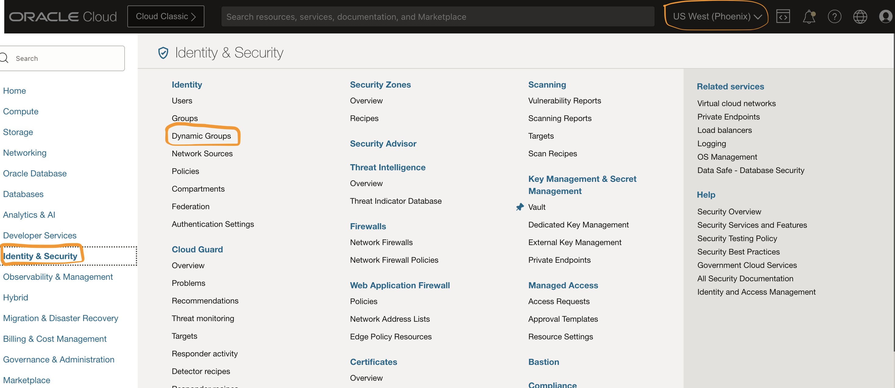

2. Click on Create Dynamic Group.

   Provide a name for the Dynamic Group.

   Provide a description for the Dynamic Group.

   You can directly write the rule in the box below Rule 1 or Click on Rule Builder to chose your rules. 

    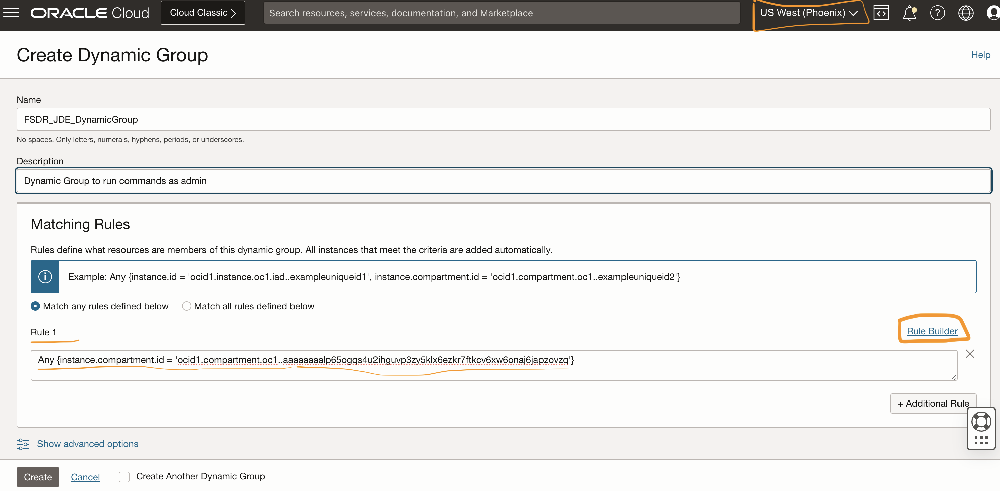

    Click on Create.

    We have added the rule for all instances in the compartment, it will include all servers in *Ashburn* and *Phoenix* regions as a part of the Dynamic Group.

3. Running Commands with Administrator Privileges

  If a command requires administrator permissions, you must grant administrator permissions to the Compute Instance Run Command plugin to be able to run the command. The plugin runs as the ocarun user.

  To grant sudo permissions on Linux instances, please run below commands in all the Linux VMs on the primary as well as standby (for non-movable).

    - On the instance, create a sudoers configuration file for the Compute Instance Run Command plugin:

     ````
      <copy>vi ./101-oracle-cloud-agent-run-command</copy>

     ````

    - Allow the ocarun user to run all commands as sudo by adding the following line to the configuration file:

     ````
      <copy>ocarun ALL=(ALL) NOPASSWD:ALL</copy>

     ````

    - Validate that the syntax in the configuration file is correct:

     ````
      <copy>visudo -cf ./101-oracle-cloud-agent-run-command</copy>

     ````

    If the syntax is correct, the follow message is returned:


      **./101-oracle-cloud-agent-run-command: parsed OK**

    - Add the configuration file to /etc/sudoers.d:

     ````
      <copy>sudo cp ./101-oracle-cloud-agent-run-command /etc/sudoers.d/</copy>

     ````

    **To grant administrator permissions on Windows instances**

    - On all of the Windows instances, run the following command in PowerShell:

     ````
      <copy>Add-LocalGroupMember -Group "Administrators" -Member "NT SERVICE\OCARUN" | Restart-Service -Name OCARUN -Force</copy>

     ````

## Task 2: Preparing Object Storage Buckets for Operation Logs

Full Stack Disaster Recovery configurations uses Object Storage to store Disaster Recovery (DR) operation logs.

Before you create any DR configurations, you must create Object Storage buckets in both Ashburn (primary) and Phoenix (standby) regions to include in the DR configuration process.

Oracle recommends that you follow these guidelines when creating the Object Storage bucket:

- Use a separate dedicated bucket for each DR protection group.
- Use Standard storage tier, not **Archive**.
- Do not set up replication for this object store bucket.
- Do not use this bucket to write other data, reserve it exclusively for use for logs for one DR protection group.
- Ensure that the object store bucket is writable by the user running DR plan executions.

1. Login into OCI Console. The primary region should be **Ashburn**.

    

2. Select **Storage** from the Hamburger menu, then **Buckets**. Verify the region is **Ashburn**.

    

3. Click on Create Bucket and provide a name for the bucket and select the Default Storage Tier as **Standard**. Click on Create.

    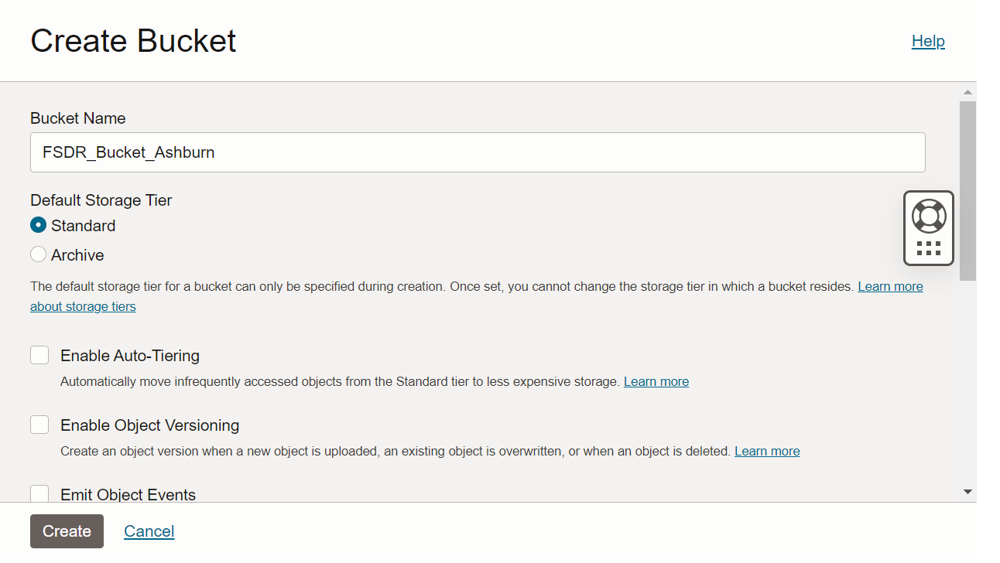

4. Change the region to **Phoenix** and create a similar bucket in the standby region following the above steps.

## Task 3: Preparing Oracle Databases for Full Stack Disaster Recovery

1. Create a vault in the Phoenix (standby) region. We need this in both regions to store DB credentials to be used for FSDR.

    From the Phoenix region OCI console, select **Identity & Security** from the Hamburger menu then **Vault**.

    

2. Click on Create Vault. Select the right compartment and provide a name for the Vault. Click on Create Vault. Vault will now be created.

    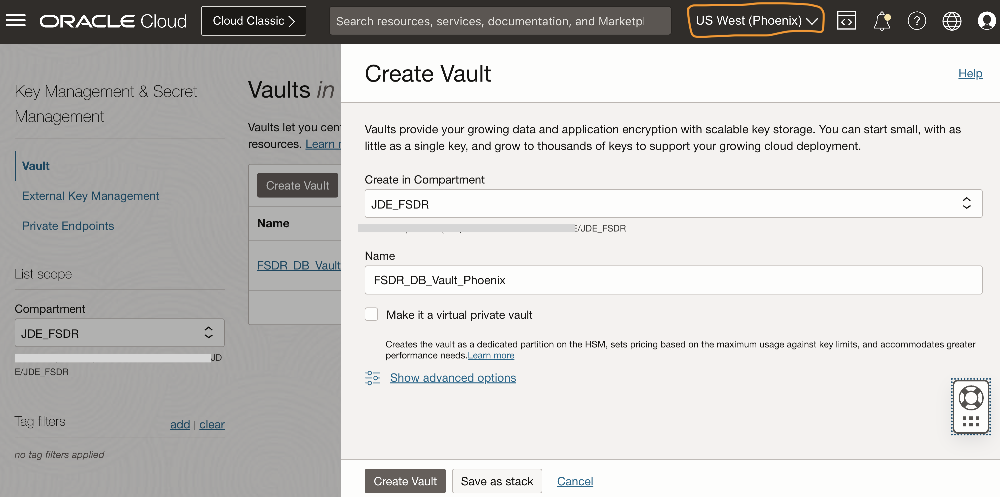

3. Click on newly created Vault and Under Resources, click on Master Encryption Keys and click on Create Key.

    

4. Select the right compartment, Protection Mode as **HSM** and provide a name for the Key, Key Shape:Algorithm will be **AES (Symmetric key used for Encrypt and Decrypt)** and Key Shape:Length as **256** bits. Click on Create Key.

    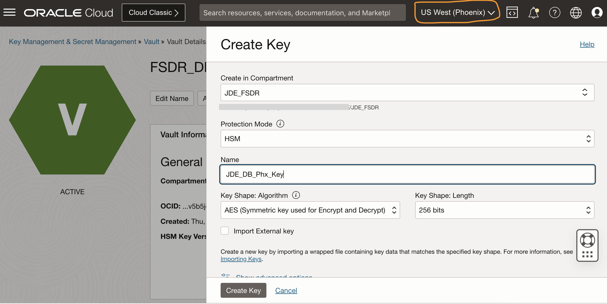

5. Under Resources, click on Secrets and click on Create Secrets.

    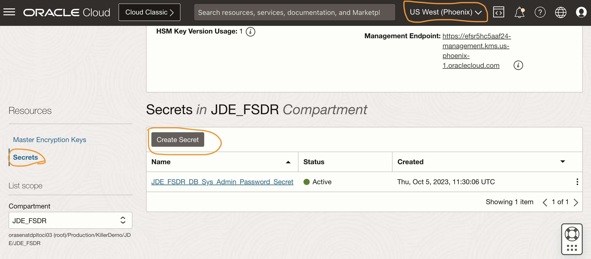

6. Select the right compartment, provide a name for the secret, a description for the secret, select the Master Encryption Key created in the previous task from the drop down, Secret Type Template as **Plain-Text**, provide the DB SYS user password in plain text format in the Secret Contents.

    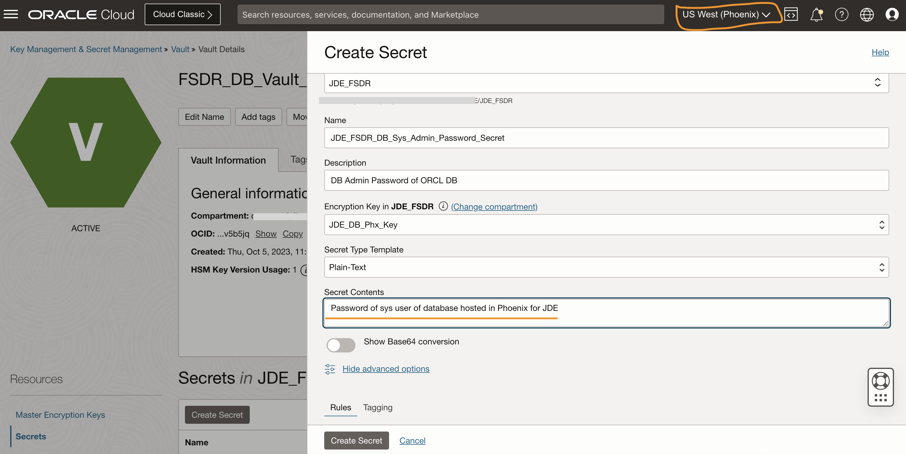

7. Change the region to Ashburn. Create the the Vault, Master Encryption Key and Secret same as done in Phoenix region following the above steps 1 to 6.

## Task 4: Create Volume Group with all boot and block volumes for JDE VMs.

  For adding the **Compute Instances** as a member to the DRPG with a **Moving Instance** strategy, we need to add their block and boot volumes as a member. We can do that by creating a **Volume Group** and add all the volumes.

   1. Go to **OCI Console** home page, select **Storage** from the navigation menu and click on **Volume Group**
   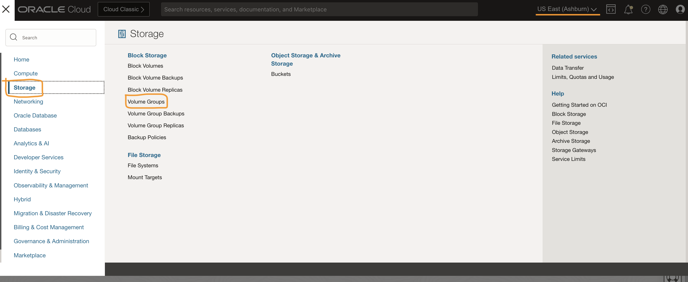

   2. On the **Create volume group** page, provide a suitable **Name** to the volume group. Select the **Compartment** where all the JDE VMs are present. Select the availability domain of your choice and click **Next**.
   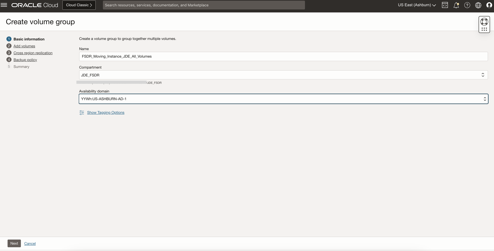

   3. Add the volumes to the group by selecting the **block and boot** volumes from the drop-down which will show a list of all volumes present in the selected compartment. Click on **"+ Additional Volume"** to add more volumes.
   

   4. Validate that all the **block and their respective boot volumes** are added to the group and click **Next**. 
   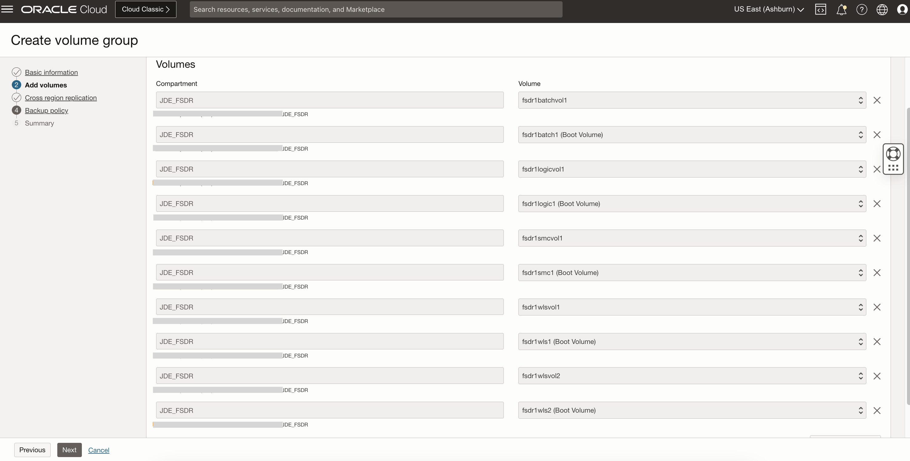

   5. As the DR would need cross region replication, select the **ON** button below **Cross region replication**, select the target region as your standby region and a suitable availability domain. Check the **Confirm** option at the end and click **Next**. 
   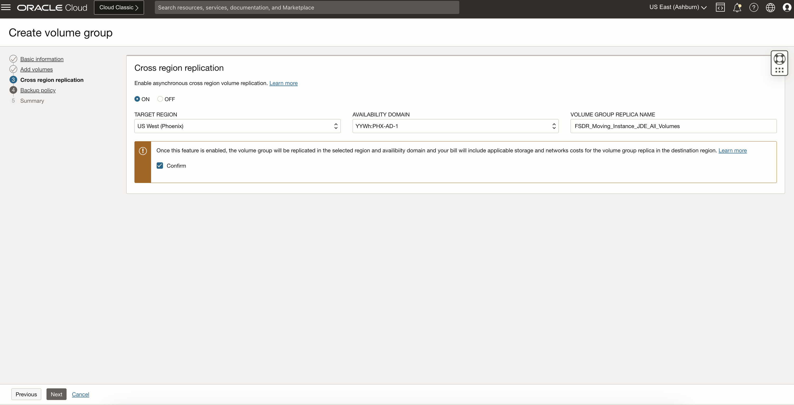

   6. Selecting a Backup policy is optional, keep it blank and click **Next**.
   

   7. Validate all the required information are provided at the **Summary** page and click **Create**.
   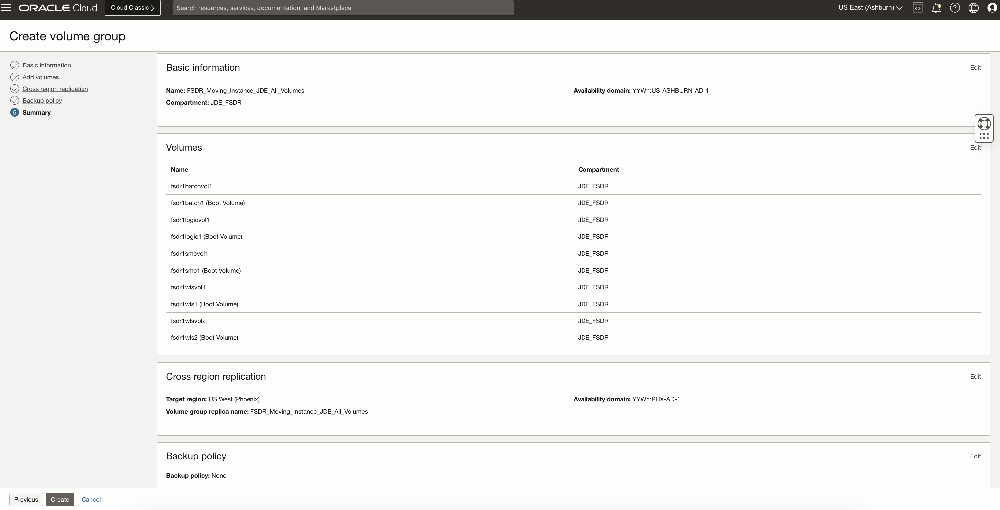

   8. In few seconds, you should be seeing the Volume group created and in available status.
   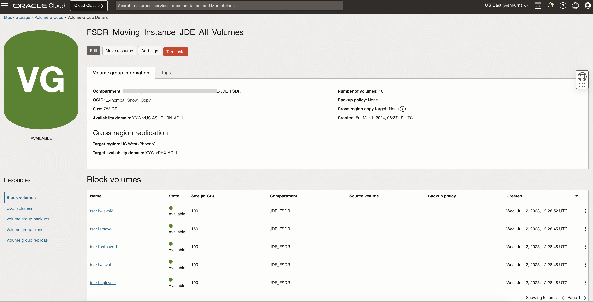

## Task 5: Create Automation Scripts and Backup Files for the DR Switchover

1. Login to the primary **Logic Server** VM, create a script file as **update_hosts.sh** with below content at location **/etc/** as root and provide full permission. 

    ````
        <copy>#!/bin/bash
  
        # Get the current IP address of the machine
        new_ip_address=$(hostname -I | awk '{print $1}')

        # Specify the old text and new text you want to replace in the /etc/hosts file
        old_text="vcnfsdr"
        new_text="vcndr"

        # Update the /etc/hosts file with the new IP address and replace old text with new text
        sed -i "s/\b$old_text\b/$new_text/g" /etc/hosts
        sed -i "s/<IP address of primary server>/$new_ip_address/g" /etc/hosts

        echo "Updated /etc/hosts file with new IP address: $new_ip_address and replaced '$old_text' with '$new_text'."</copy>

     ````**vcnfsdr** = VCN for the primary region, 
        **vcndr**   = VCN for the standby region. Update the same for your own VCN details.

    Create another script file as **update_ini.sh** at location **/u01/jde920/e920/ini/** with full permission to **oracle** user with below details. 

    ````
        <copy># Define the old and new file names
old_file2="JDE_DR.INI"
old_file3="jdbj_dr.ini"
new_file2="JDE.INI"
new_file3="jdbj.ini"

# Check if the old files exist in the folder
if [ -e "$old_file2" ] && [ -e "$old_file3" ] ; then
    # Rename the second file
    mv "$old_file2" "$new_file2"
    echo "Renamed $old_file2 to $new_file2"

    # Rename the third file
    mv "$old_file3" "$new_file3"
    echo "Renamed $old_file3 to $new_file3"
else
    echo "Old files do not exist in the folder."
fi</copy>
    ````

2. On the **Logic Server**, create a backup of tnsnames.ora as **tnsnames\_dr.ora** keeping the permission same as the original file at location **/u01/oracle19/product/19.0/client_1/network/admin/**

    Update the HOST and VCN with the Standby Database details, underlined in the example below.
    
  
     
    Create a backup of JDE.INI as **JDE_DR.INI** at location /u01/jde920/e920/ini/ keeping the same permission as the original file. 
    Update the backed up file with the standby DB server details for the parameter below. 
            
        [DB SYSTEM SETTINGS]
        Server=dgdr1db1   
        
    Create a backup of jdbj.ini as **jdbj_dr.ini** at location /u01/jde920/e920/ini/ keeping the same permission as the original file.
    Update the backed up file with the standby DB server details for the parameter below. 

        [JDBj-BOOTSTRAP DATA SOURCE]
        server=dgdr1db1
        
3. Create similar scripts and backup files on the primary **Batch Server** following the above two steps. 

4. Login to the **Web Server** to update the HTML and AIS server details. 

    Create a script file as **update\_tnsnames\_jdbj.sh** with full permission to **oracle** user at location **/u01/jde_home/SCFHA/targets/fsdr11htm1/config** with below contents. 
    ````
   <copy>#!/bin/bash

#Define the old and new file names
old_file1="tnsnames_dr.ora"
old_file2="jdbj_dr.ini"
new_file1="tnsnames.ora"
new_file2="jdbj.ini"

# Check if the old files exist in the folder
if [ -e "$old_file1" ] && [ -e "$old_file2" ]; then
    # Rename the first file
    mv "$old_file1" "$new_file1"
    echo "Renamed $old_file1 to $new_file1"
    
    # Rename the second file
    mv "$old_file2" "$new_file2"
    echo "Renamed $old_file2 to $new_file2"
else
    echo "One or both of the old files do not exist in the folder."
fi</copy>
````
   **Note:** Create similar scripts at other HTML instances if you have on the same Web Server VM. 

5. On the **Web Server**, for **HTML**, create backups of dbj.ini and tnsnames.ora files as **jdbj\_dr.ini** and **tnsnames\_dr.ora** respectively at location **/u01/jde_home/SCFHA/targets/fsdr11htm1/config/** with same permission as the original files. 

    Update the **tnsnames\_dr.ora** file with HOST and VCN from the Standby Database server, underlined in the example below.
    

    Update the **jdbj\_dr.ini** file with hostname of the Standby Database server as below. 
    
        [JDBj-BOOTSTRAP DATA SOURCE]
        server=dgdr1db1
    
   **Note:** Create backup files at other HTML instances if you have on the same Web Server VM. 

6. On the **Web Server**, for **AIS**, create a script file as **update\_rest\_ini.sh** at location **/u01/jde_home/SCFHA/targets/fsdr11ais1/config** with below details.

    ````
    <copy>#!/bin/bash
    
    # Define the old and new file names
    old_file1="rest_dr.ini"
    new_file1="rest.ini"
    
    # Check if the old files exist in the folder
    if [ -e "$old_file1" ]; then
        # Rename the first file
        mv "$old_file1" "$new_file1"
        echo "Renamed $old_file1 to $new_file1"
        
    else
        echo "One or both of the old files do not exist in the folder."
    fi</copy>
    ````
    **Note:** Create similar scripts at other AIS instances if you have on the same Web Server VM.

7. On the **Web Server**, for **AIS**, create backup of rest.ini file as **rest\_dr.ini** at location **/u01/jde_home/SCFHA/targets/fsdr11ais1/config/** and update the below parameter with the standby database host and VCN details. 

        [SCHEDULER]								
        JDBCUrl=jdbc:oracle:thin:@dgdr1db1:1521/jdepdb.privatregsub.vcndr.oraclevcn.com

    **Note:** Create similar backup files at other AIS instances if you have on the same Web Server VM. 

8. Login to the **SMC Server**, create a script file as **update\_managaement\_console.sh** at location **/u01/SMConsole/SCFMC/targets/home** with below details.
    ````
    <copy>#!/bin/bash

# Define the old and new file names
old_file1="management-console_dr.xml"
new_file1="management-console.xml"

# Check if the old files exist in the folder
if [ -e "$old_file1" ]; then
    # Rename the first file
    mv "$old_file1" "$new_file1"
    echo "Renamed $old_file1 to $new_file1"
else
    echo "One or both of the old files do not exist in the folder."
fi</copy>
    ````

    On the **SMC Server**, create a script file **update\_agent\_properties.sh** at location **/u01/SMConsole/SCFMC/config** with below details and full permission to run. 

    ````
    <copy>#!/bin/bash

# Define the old and new file names
old_file1="agent.properties"
new_file1="agent_dr.properties"

# Check if the old files exist in the folder
if [ -e "$old_file1" ] && [ -e "$old_file2" ]; then
    # Rename the first file
    mv "$old_file1" "$new_file1"
    echo "Renamed $old_file1 to $new_file1"
else
    echo "One or both of the old files do not exist in the folder."
fi</copy>
````

    On the **SMC Server**, create backup of agent.properties file as **ragent\_dr.properties** at location **/u01/SMConsole/SCFMC/config** and update the VCN with the standby details. 

    management.server.name=fsdr1smc1.privatregsub.**vcndr**.oraclevcn.com

    On the **SMC Server**, create backup of management-console.xml file as **management-console\_dr.xml** at location **/u01/SMConsole/SCFMC/targets/home** and update the database hostname and vcn with the standby details.

        fsdr1db1 to dgdr1db1 and vcnfsdr to vcndr in our case. 


    On the **SMC Server**, create a script file as **update_hosts.sh** with below content at location **/etc/** as root and provide full permission. 

    ````
        <copy>#!/bin/bash
  
        # Get the current IP address of the machine
        new_ip_address=$(hostname -I | awk '{print $1}')

        # Specify the old text and new text you want to replace in the /etc/hosts file
        old_text="vcnfsdr"
        new_text="vcndr"

        # Update the /etc/hosts file with the new IP address and replace old text with new text
        sed -i "s/\b$old_text\b/$new_text/g" /etc/hosts
        sed -i "s/<IP address of primary server>/$new_ip_address/g" /etc/hosts

        echo "Updated /etc/hosts file with new IP address: $new_ip_address and replaced '$old_text' with '$new_text'."</copy>

     ````**vcnfsdr** = VCN for the primary region, 
        **vcndr**   = VCN for the standby region. Update the same for your own VCN details.


## Acknowledgements

* **Author:** Tarani Meher, Principal Cloud Architect
* **Last Updated By/Date:** Tarani Meher, Principal Cloud Architect, May-2024
